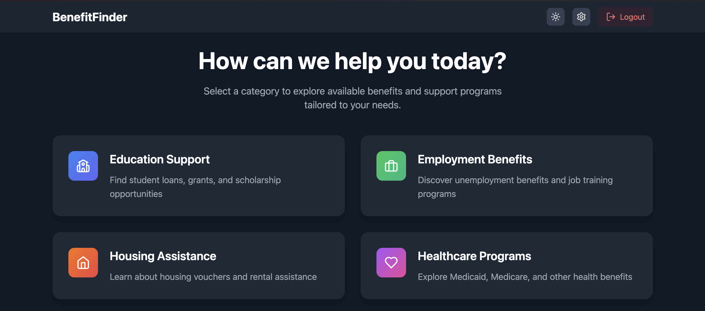

Developed at **CruzHacks 2025**, Benefit Finder is an AI-powered platform designed to aggregate user demographics and identify eligible government benefits using Gemini Deep Research APIs. Our team was awarded "Best Beginner Hack" for our prototype, and we have since moved into active collaboration with the **City of Santa Cruz** to pilot the tool as a public service.

Initially built with a Python backend, I led the effort to refactor the entire platform to a full **TypeScript** stack to improve maintainability, type safety, and integration with modern web frameworks. The current pilot focus is on data privacy compliance and the implementation of automated application-filling features to reduce the administrative burden on citizens.

The platform streamlines the discovery of student resources, government aid, and local initiatives. By leveraging Google's Firebase and Gemini services, Benefit Finder eliminates the need for manual scraping, instead utilizing structured API research to find the most up-to-date eligibility criteria.
