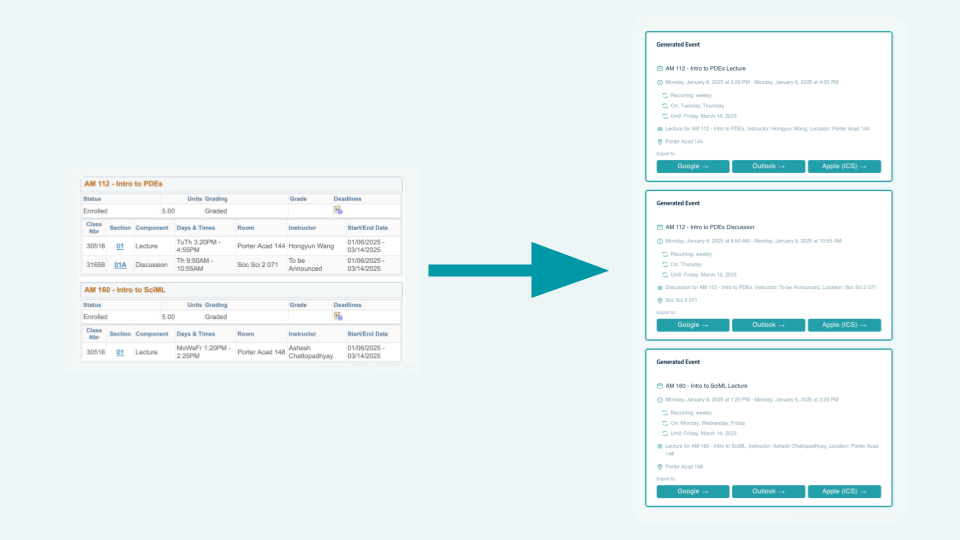

Calendarize is an AI powered media to calendar converter. It uses a backend written in python and the Gemini-2.0-Flash-lite RESTful as an OCR and Parser to extract important event details from Images and documents. The app then constructs a calendar event, ICalendar string, and google and Outlook calendar links for the event. The Front end is written in typescript and communicates with the backend with fast API. The front end allows a user to paste, or upload an image or document and then add details in a text box before the user clicks a button to convert the media to a calendar event. The app then displays the event details in blocks and allows the user to download a .ICS file, or add the event to their google or outlook calendar.
