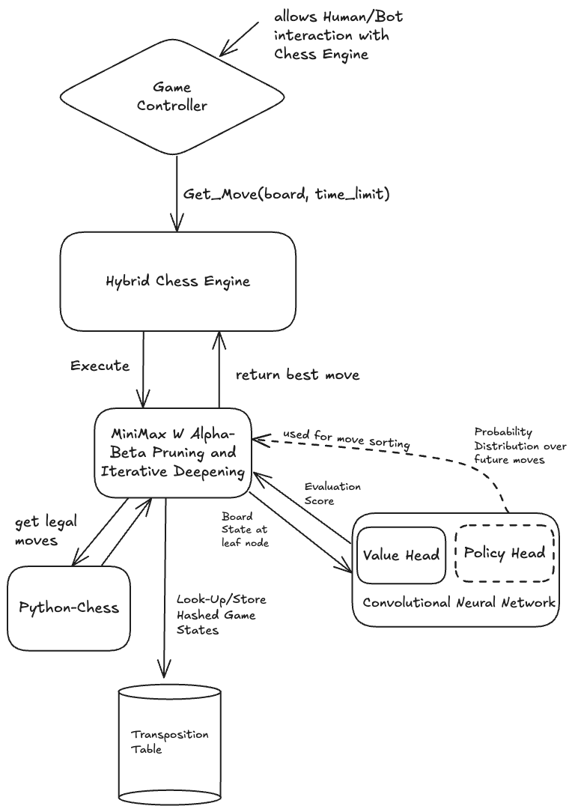

This project was my final report for CMPM 118, where my team and I set out to build a practical middle ground between traditional rule-based engines like Stockfish and massive reinforcement learning systems like AlphaZero. We built a hybrid engine that pairs a lightweight ResNet-based neural network with a classical Alpha-Beta search. This allows the model to provide high-level "intuition" about a position while the search algorithm handles the tactical depth and precision.

### The Brain: ResNet Evaluation

The core of our system is a convolutional neural network designed as a positional judge. Unlike AlphaZero which requires massive self-play, we trained our model on the Lichess Elite Database, a collection of games from players with 2500+ ELO.

We represented the board as a 20x8x8 tensor. This includes 12 channels for piece positions and 8 channels for contextual metadata like castling rights, en passant targets, and the game phase. We even experimented with temporal context by stacking the previous four board states, allowing the model to "see" the momentum of the game. The network architecture uses 3 Residual Blocks with 64 hidden channels, reducing the complex board state into a single value between -1 and 1 via a tanh activation.

### The Muscle: Optimized Minimax Search

For the search, we implemented a Minimax algorithm enhanced with Alpha-Beta pruning and Iterative Deepening. While most engines use handcrafted heuristics for evaluation, we plugged in our neural network's value head.

To solve the performance bottleneck of running neural network inference during a search tree, we implemented a **Policy Head**. Instead of sorting moves by simple heuristics like captures, the Policy Head predicts what a strong human would play. By exploring these high-probability moves first, we trigger Alpha-Beta pruning much earlier, allowing us to reach a depth of 6 ply within a 2-3 second move limit.

### Performance & Results

In testing against various levels of Stockfish, our hybrid engine achieved an estimated ELO of **1647**. This was a significant jump over our baseline Minimax engine (1420 ELO) and completely eclipsed random play (400 ELO).

_First generation of the model featuring only the value head, which was susceptible to gradient saturation and overfitting._

_Second generation of the model with the added policy head and a more robust training pipeline featuring cosine learning rate scheduling._

One of the biggest challenges was training. We initially tried training on an M2 Mac, but it was taking over 10 hours per epoch. Moving to an A100 via Colab Pro brought this down to 3 hours, allowing us to implement Cosine Learning Rate scheduling and gradient clipping, which fixed our early issues with gradient saturation and overfitting.

### Future Work

While 1647 ELO is a solid intermediate level, the "horizon effect" still occasionally trips the engine up. In the future, I'm interested in exploring Monte Carlo Tree Search (MCTS) to better integrate the policy head and experimenting with model quantization to push our search depth even further.

### Technical Report

For a deeper dive into the mathematics and experimental setup, you can read our [Final LaTeX Report](./CMPM_118__Final_Project.pdf).

### Credits

This project was a collaborative effort by:

- **Max Ratcliff**
- **Avni Gandhi**
- **Mann Malviya**
- **Abby Kaur**
