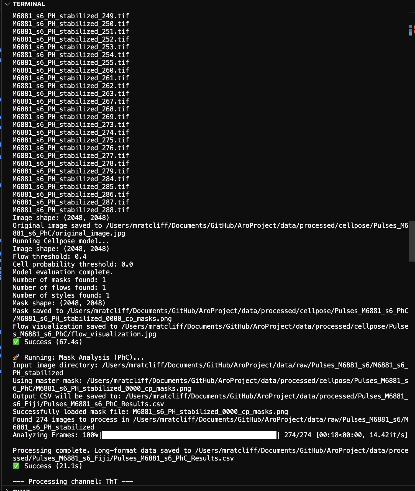

This project is a customized automated data extraction and prediction pipeline for bacterial germination research, developed as part of my undergraduate research under Dr. Marcella Gomez at the University of California, Santa Cruz. The pipeline leverages the  computer vision model to extract relevant data from microscopy images of germinating bacteria. The pipeline takes in raw microscopy images, processes them using cellpose to identify and segment individual bacterial cells, and then extracts key characteristics such as size, shape, color, and intensity. The extracted data is then cleaned and organized into a structured format suitable for analysis. Finally, the cleaned data is fed into an LSTM (Long Short-Term Memory) model to predict next-frame germination patterns based on the observed characteristics of the bacteria. The LSTM model is trained on historical data to learn temporal patterns in bacterial germination, allowing it to make accurate predictions about future behavior. Our ultimate goal is to integrate this with a control system that uses the LSTM's predictions to dynamically adjust environmental conditions, thereby steering the bacteria towards desired population levels.