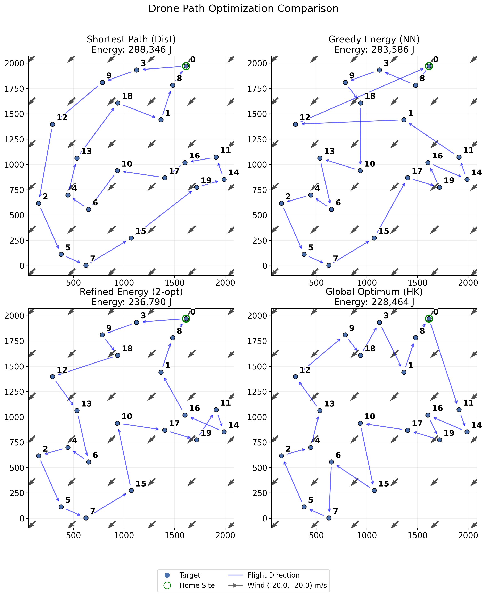
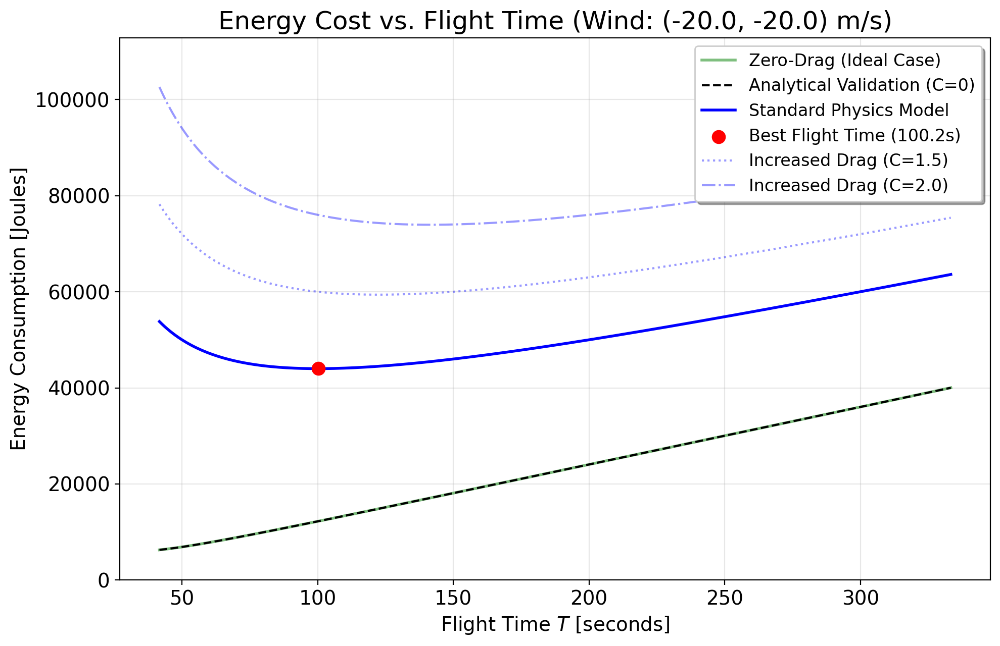

This project served as my final report for AM 170A (Mathematical Modeling 1), where I set out to prove a simple but counter-intuitive concept in autonomous robotics: for energy-constrained systems like drones, the shortest path isn't always the most efficient. To prove this, I built a physics-aware routing engine that factors in linear aerodynamic drag, constant wind vectors, and hover power, and compared its energy usage to a traditional distance-based Traveling Salesman Problem (TSP) solver.

### Step 1: Building the Physical Energy Model

The first challenge was calculating how much energy it actually takes to fly between two coordinate points. I designed a physical model where the drone follows a smooth parabolic velocity profile. By using numerical optimization, I was able to find the exact flight duration that minimized energy between any two points. 

If the drone flies too fast, aerodynamic drag drains the battery rapidly. Conversely, if it flies too slowly to reduce drag, it burns massive amounts of energy just maintaining altitude. Furthermore, flying with the wind requires significantly less energy than fighting against it, creating asymmetric costs between nodes and turning our basic distance problem into an Asymmetric Traveling Salesman Problem (ATSP).

### Step 2: Route Optimization Strategies

With a reliable energy cost matrix established, the next task was optimizing the massive routing sequence. I implemented and evaluated several optimization algorithms to balance pure optimality against runtime complexity:

- **Held-Karp (Exact):** A dynamic programming algorithm ensuring the absolute global minimum energy. While perfect, the computational complexity makes it unviable for large numbers of targets \(N>25\).
- **Nearest Neighbor (Heuristic):** An incredibly fast greedy approach that worked well, but often fell into local minimum traps leading to suboptimal path crossing.
- **NN + 2-opt Refinement:** The best of both worlds. I took the greedy Nearest Neighbor seed route and iteratively made local edge-swaps until the route couldn't be improved, resulting in large efficiency gains for minimal computational cost.

### Performance & Results

The physics-aware routing approach generated significantly better flight paths. By taking wider loops to utilize tailwinds and avoiding heavy drag scenarios, the energy-aware model reduced total power consumption by 2% to 5% (and up to 8.55% in extreme cases) compared to the naive distance-based route. Furthermore, the 2-opt refinement achieved near-exact optimality while comfortably running on an M2 Mac for large target configurations.

You can read the full final paper here: [Why Shorter Isn’t More Efficient: A Physics-Based Approach to Multi-Target Drone Routing](/projects/dronerouting/RatcliffMaxFinalReportAM170A.pdf).

