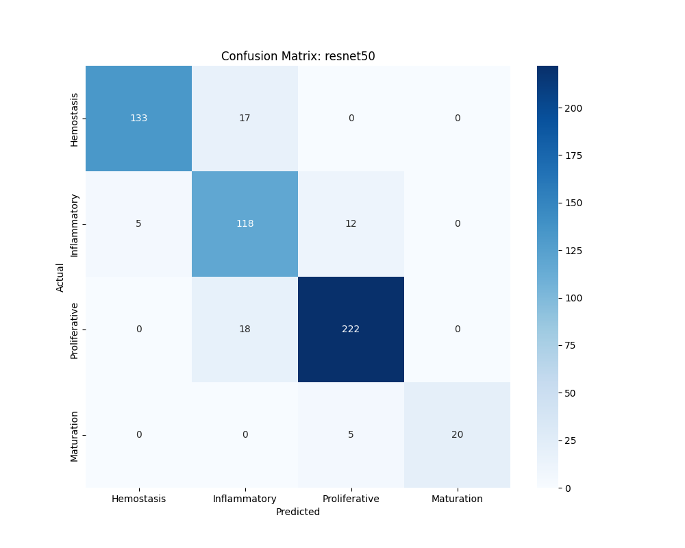
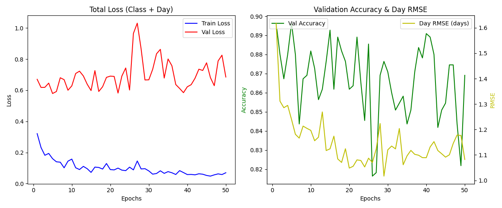

HealNet is the current extension of my ARO Lab research under Dr. Marcella Gomez. After building the lab's CellPose-based microscopy pipeline, I moved into modeling wound-healing progression directly from biomedical images and, eventually, paired transcriptomic data.

The current implementation is a multi-task PyTorch training pipeline. A pretrained ResNet backbone extracts visual features from wound images, then two task-specific heads use those shared embeddings to classify the wound stage and regress the healing day. The discrete stage task distinguishes Hemostasis, Inflammatory, Proliferative, and Maturation stages, while the regression head estimates where the sample sits along the healing timeline.

### Modeling Approach

The image branch is designed to be strong enough on its own before adding other modalities. It supports ResNet-18, ResNet-34, and ResNet-50 backbones, uses ImageNet transfer learning, and replaces the final classifier with a shared biological feature embedding. The training loop handles class imbalance with inverse-frequency class weighting, uses Huber loss for outlier-resistant day prediction, and applies early stopping when validation performance plateaus.

### Why This Fits the Lab Work

This project belongs with the same ARO Lab research thread as my CellPose pipeline. The CellPose project automated microscopy data extraction for biological control experiments; HealNet builds on that machine-learning direction by shifting from segmentation and feature extraction toward predictive modeling of biological state. The next planned step is a multimodal late-fusion model that combines ResNet image embeddings with RNA/transcriptomic signatures through an MLP branch.

### Technical Notes

- Built in Python with PyTorch and torchvision.
- Uses modular datasets, augmentation, logging, checkpointing, and analysis scripts.
- Supports local training and GPU training through Google Colab.
- Produces experiment artifacts including `history.json`, metrics plots, confusion matrices, and healing-day error distributions.
