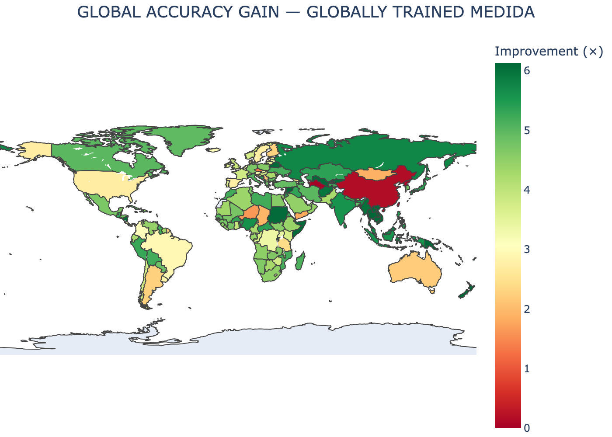
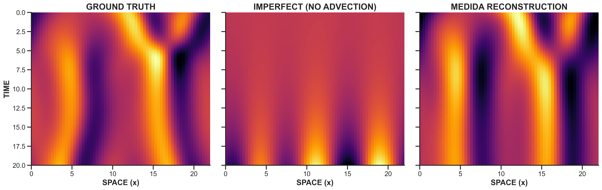
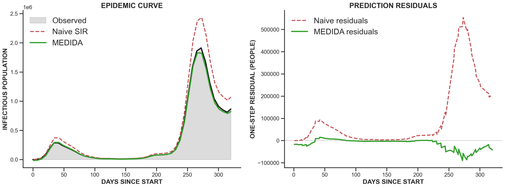

This was my AM 170B mathematical modeling research project with Alejandro Munoz, Alexander Spetzler, Anirudh Raja, and Matteo Tasso. We applied MEDIDA, which stands for Model Error Discovery with Interpretability and Data Assimilation, to synthetic epidemic models and historical COVID-19 data.

The original MEDIDA paper validated the method on a chaotic physics system. Our question was whether the same sparse, interpretable model-error discovery idea could transfer into epidemiological compartment models.

### Research Question

Can MEDIDA be applied beyond physics systems to recover missing or inaccurate terms in epidemiological models and improve predictive accuracy?

To test that, we built an imperfect model, estimated the one-step model error, regressed that error against a sparse feature library, and added the discovered correction back into the model. For the COVID case study, we used historical Our World in Data records from March 1, 2020 through January 15, 2021 and converted reported cases into approximate SIR compartments.

### Validation Work

Before moving to real epidemic data, we checked whether the implementation could recover known missing terms in synthetic systems. These included SIR-family models, Lorenz-63, and the Kuramoto-Sivashinsky PDE, which mirrors the type of physics validation used in the original MEDIDA work.

### COVID Case Study

The COVID analysis used a simple SIR model with constant transmission and recovery parameters as the imperfect baseline. MEDIDA then learned sparse corrections from both individual countries and a globally aggregated training set, then evaluated whether those corrections improved one-step predictions locally, globally, and across future epidemic waves.

The project intentionally frames these as modeling experiments rather than epidemiological forecasts. The COVID results rely on reported-case data, undercount assumptions, and a 14-day infectious window, so the value is in testing interpretable model-error recovery rather than making clinical or policy claims.

### Final Report

You can read the full final report here: [MEDIDA for Epidemics](/projects/medida-epidemiology/MEDIDA_for_Epidemics.pdf).

### Technical Notes

- Implemented in Python with reusable MEDIDA modules and command-line analysis scripts.
- Generated synthetic recovery experiments, country-level COVID analyses, transfer sweeps, global maps, and failure-case plots.
- Used Matplotlib's headless backend so experiments could run from terminal sessions and reproducibly write outputs.
