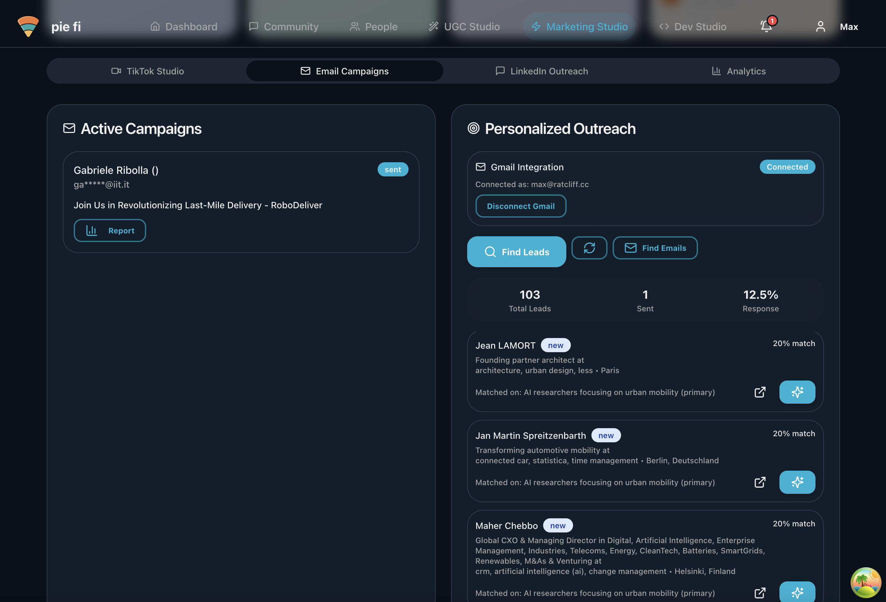

Im building this project in collaboration with a team of 4 other SlugAI members at UC Santa Cruz. PieFi is an all-in-one startup accelerator platform designed to streamline the process of launching and growing a startup. The platform offers a comprehensive suite of tools and resources to help founders manage various aspects of their business, from ideation to funding and growth. We are working with local startup serial founder Sol Lipman to build a new generation of VC that allows large numbers of developers and founders to connect, build, and ship rapidly together. The platform includes daily progress vlogs that are automatically processed and stiched together into instagram ready build in public videos. The platform also features a discord like community hub where founders can connect, share ideas, and collaborate on projects, the Oracle provides personalized guidance and support as well as assiting with making connections and finding a team. Additionally, PieFi includes a claude code instance to help democratize acesss to development tools and resources, allowing founders to quickly prototype and iterate on their ideas.

I personally am working on an automated email outreach and lead discovery system, where we injest a user's profile information and search for hundreds of potentially interested investors, partners, and customers, and then automatically reaches out to them with personalized cold emails. The system uses a combination of semantic people search, natural language processing, and machine learning to identify and prioritize leads based on their relevance. The email outreach component leverages an LLM to generate personalized email content that is tailored to each recipient's interests and needs and reflects how the user's startup can provide them value, increasing the chances of a positive response. The system also includes analytics and reporting features to track the effectiveness of the outreach campaigns and optimize future efforts.
