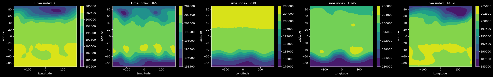
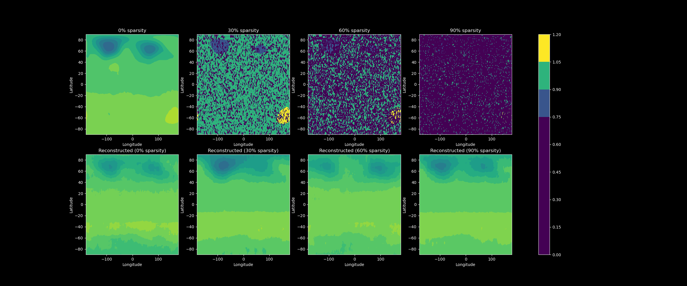
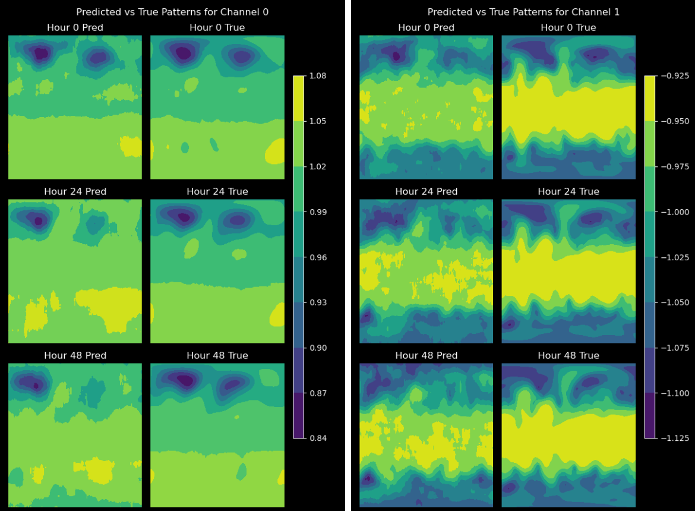
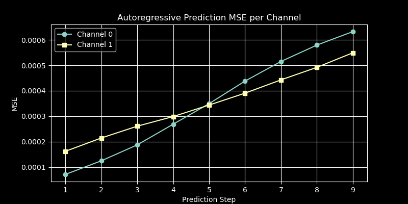

This was my final project for AM160 (Scientific ML). For this project I dove into modeling complex weather patterns using real atmospheric data from 1979-1985. The first step was just getting a handle on the data itself – specifically the 'z' variable (geopotential height). After normalizing it to make it easier for my model to learn. I plotted some contour maps to visualize how weather features change across the globe and over time.

The First task was to build a denoising variational autoencoder to reconstruct sparse or missing data. The architecture I chose used a 2d convolutional encoder-decoder structure. The encoder compresses the input data into a latent space, while the decoder reconstructs it back to the original shape. I trained the model on the first 4 years of the dataset by nulling random spacial values at every time step. By training on a varying level of sparsity, and then fine tuning on full data allowed me to bring my MSE really low.

Building on this architecture, I adapted the VAE to autoregressively predict future time steps. Again using the first 4 years as training data, I trained the model to predict the next time step given the previous time steps. The model was able to learn the temporal dependencies in the data and generate realistic future states. I used a similar encoder-decoder structure, but with a layer to generate a conditional embedding. After training I was able to generate up to 48 hours or 8 time steps in the future with an MSE under 0.0006

Overall, this project was an incredibly fun challenge, and it was fascinating to explore of how ML models, in our case VAEs can tackle real scientific challenges like reconstructing incomplete/lost data and forecasting complex chaotic systems like weather. I'm exited to take this further and explore how other architectures perform on similar tasks and other applications of VAEs in scientific ML.
